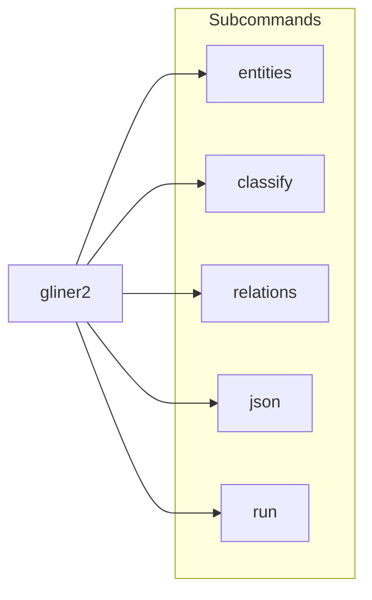

# Gliner2 Rust


[](https://github.com/paul-english/gliner2_rs/actions)
[](https://crates.io/crates/gliner2)
[](https://docs.rs/gliner2)
[](https://deps.rs/repo/github/paul-english/gliner2_rs)


This project implements the [Gliner2](https://github.com/fastino-ai/GLiNER2) model in rust with compatibility to the original weights and output of the python training.

```bash
cargo add gliner2

# and/or for a cli utility
cargo install gliner2
gliner2 setup # allows configuring candle,tch; device (cuda, rocm, cpu)

# Run with tch-rs
# LibTorch encoder for the example binary: 
cargo install gliner2 --features tch
gliner2 --backend tch # (or GLINER2_BACKEND=tch)

# Quick, has both tch & candle backends
cargo binstall gliner2
```

If you're using an accelerator
- CUDA: libtorch for CUDA requires the [nvidia container toolkit]().

## Code coverage

Rust tests are covered with [cargo-llvm-cov](https://github.com/taiki-e/cargo-llvm-cov) (LLVM source-based coverage). This does **not** measure the Python code under `harness/`.

**One-time setup:**

```bash
cargo install cargo-llvm-cov
rustup component add llvm-tools-preview
```

If the LLVM tools component is missing, `cargo llvm-cov` will report what to install.

**Workspace (default features; matches `cargo test --workspace`):**

```bash
cargo llvm-cov --workspace --html
# LCOV for external tools (writes lcov.info in the repo root; gitignored):
cargo llvm-cov --workspace --lcov --output-path lcov.info
```

Open the HTML report path printed by the command (artifacts live under `target/`, which is gitignored).

**Optional — `gliner2` with `tch` + `download-libtorch` (matches CI `cargo test -p gliner2 --features tch,download-libtorch`):**

```bash
cargo llvm-cov -p gliner2 --features tch,download-libtorch --html
```

This exercises `tch_parity` and LibTorch-related code paths not covered by the default workspace run alone.

## Recorded speed (comparison harness)

The [harness/](harness/) scripts run the same **release** Rust binaries (`harness_compare`, `harness_compare_mt` on CPU) against the PyPI `gliner2` package. Timing fields are wall-clock milliseconds from a single process: `load_model_ms` is one-time load; `infer_ms` is per-fixture forward work (entity harness sums all cases for the total row).

**Reproduce (CPU vs CPU):** from the repo root, with Hugging Face access for the default model:

```bash
uv sync --locked --directory harness
# All three flows (entity + multitask + throughput), each with Rust Candle + Rust tch-rs + Python.
# Optional: --candle-only (skip tch-rs / LibTorch), --update-readme (refresh comparison tables in this file)
bash harness/run_compare_all.sh
# Or run steps separately:
bash harness/run_all.sh
bash harness/run_multitask.sh
```

**Rust (tch-rs) timings in the tables:** `bash harness/run_compare_all.sh` sets `GLINER2_BENCH_TCH=1` so every step runs **Candle, tch-rs, and Python**. For `run_all.sh` / `run_multitask.sh` / `run_throughput.sh` alone, set `GLINER2_BENCH_TCH=1` yourself when you want tch-rs. The harness rebuilds `harness_compare` / `harness_throughput` with `--features tch-backend,download-libtorch`, so `torch-sys` downloads a **CPU LibTorch** that matches the pinned `tch` crate (no system LibTorch required). Before running the release binaries, the scripts source [harness/prepend_libtorch_ld_path.sh](harness/prepend_libtorch_ld_path.sh) so the dynamic loader can find `libtorch_cpu.so` under `target/release/build/torch-sys-*/out/...`. Alternatively, install LibTorch yourself and set `LIBTORCH` / `LD_LIBRARY_PATH`; then build with `tch-backend` only (omit `download-libtorch`).

**Entity/multitask compare vs tch:** `compare.py` / `compare_mt.py` check **Candle Rust vs Python** for correctness. The tch JSON is used for **extra timing columns** only. On the current LibTorch encoder bridge, **NER fixture outputs from `--backend tch` can be empty or otherwise diverge from Candle** while wall-clock `infer_ms` is still meaningful. To run the full shell flow without failing on unrelated checks, use `GLINER2_COMPARE_WARN_ONLY=1` with `run_all.sh` / `run_multitask.sh` when needed.

The shell wrappers call Python with `CUDA_VISIBLE_DEVICES=` and `--device cpu` so PyTorch does not use a discrete NVIDIA GPU and weights stay on CPU, matching the Rust side.

For **apples-to-apples timing** with the Rust single-forward path, Python uses `**batch_size=1`**: `batch_extract_entities([text], …, batch_size=1)` on the entity harness and `batch_extract([text], schema, batch_size=1, …)` on the multitask harness (instead of relying on `extract` / `extract_entities` defaults).

**Reading ratios:** for infer times, `python/candle` is `(python infer_ms) / (rust Candle infer_ms)` per case or for the total line. Values **below 1** mean Python spent less time on that measure for these fixtures; **above 1** mean Python was slower. When tch-rs is included (default for `run_compare_all.sh`, or `GLINER2_BENCH_TCH=1` for `run_all.sh` / `run_multitask.sh` alone), `compare.py` / `compare_mt.py` also print `tch/candle` and `python/tch`. The **per-case entity table** below lists both `python/candle` and `python/tch` (the latter is `(python infer_ms) / (rust tch-rs infer_ms)`). In the **auto-generated** tables from `patch_readme.py`, **bold** marks the **lowest** time in milliseconds in that row (load, sum, per-case, or throughput lane) and the **highest** samples/s in throughput rows; ties are all bolded.

### CPU vs CPU (recorded)

<!-- gliner2-harness:cpu-recorded -->
Model: `fastino/gliner2-base-v1`. **Recorded:** 2026-04-05 (Linux x86_64, local run; numbers vary by machine and load). **tch-rs `infer_ms`:** LibTorch encoder path with `download-libtorch` + [prepend_libtorch_ld_path.sh](harness/prepend_libtorch_ld_path.sh); see caveat above on NER outputs vs Candle.
<!-- /gliner2-harness:cpu-recorded -->

**Entity harness** ([harness/fixtures.json](harness/fixtures.json)) — metadata and per-case infer times:


<!-- gliner2-harness:entity-summary -->
|                              | Rust (Candle) | Rust (tch-rs)   | Python           |
| ---------------------------- | ------------- | --------------- | ---------------- |
| `device_note`                | `cpu`         | `cpu_libtorch` | `cpu`            |
| `load_model_ms`              | 262.0         | 1072.3          | 3422.5          |
| Sum of `infer_ms` over cases | 378.1         | 151.7           | 249.0            |
| Ratios (total infer)         | —             | tch/cnd **0.40×** | py/cnd **0.66×**; py/tch **1.64×** |
<!-- /gliner2-harness:entity-summary -->


<!-- gliner2-harness:entity-footnote -->
† Expected device label for tch-rs harness JSON when LibTorch is used (`run_compare_all.sh` enables this by default; otherwise set `GLINER2_BENCH_TCH=1`).
<!-- /gliner2-harness:entity-footnote -->


<!-- gliner2-harness:entity-cases -->
| Case id             | Candle `infer_ms` | tch-rs `infer_ms` | python `infer_ms` | `python/candle` | `python/tch` |
| ------------------- | ----------------- | ----------------- | ----------------- | --------------- | ------------ |
| `microsoft_windows` | 86.8 | 35.9 | 50.2 | 0.58× | 1.40× |
| `steve_jobs` | 94.5 | 38.8 | 72.6 | 0.77× | 1.87× |
| `sundar_pichai` | 96.3 | 36.9 | 59.7 | 0.62× | 1.62× |
| `tim_cook_iphone` | 100.6 | 40.0 | 66.4 | 0.66× | 1.66× |
<!-- /gliner2-harness:entity-cases -->


**Multitask harness** ([harness/fixtures_multitask.json](harness/fixtures_multitask.json)) — single fixture `entities_plus_sentiment`:


<!-- gliner2-harness:multitask-summary -->
|                      | Rust (Candle) | Rust (tch-rs)   | Python           |
| -------------------- | ------------- | --------------- | ---------------- |
| `device_note`        | `cpu`         | `cpu_libtorch` | `cpu`            |
| `load_model_ms`      | 244.4         | 1091.5          | 3133.2           |
| Sum of `infer_ms`    | 100.2         | 42.4           | 82.5            |
| Ratios (total infer) | —             | tch/cnd **0.42×** | py/cnd **0.82×**; py/tch **1.95×** |
<!-- /gliner2-harness:multitask-summary -->


These are **short-fixture** timings. Update the tables when you change the model, fixtures, or harness code in a way that affects performance.

### Throughput (local only; not in CI)

**These benchmarks are not run in GitHub Actions** (see [.github/workflows/ci.yml](.github/workflows/ci.yml)). Run them on your machine when you need larger-sample timing.

The harness uses **64 samples** by default, built by cycling texts from [harness/fixtures.json](harness/fixtures.json). Every sample uses the same entity label list `["company", "person", "product", "location", "date"]` so Rust [batch_extract_entities](src/extract.rs) and PyPI `batch_extract_entities` can process the full set. **Sequential rows** use **64× micro-batches of size 1** on both sides (Rust’s `forward` loop vs Python `batch_extract_entities([t], …, batch_size=1)`). **Batched rows** are timed at **`batch_size` 8 and 64** (Rust `--rust-batch-size` and Python `batch_extract_entities` with the same batch sizes).

```bash
uv sync --locked --directory harness
bash harness/run_throughput.sh
```

Optional: `bash harness/run_throughput.sh [fixtures.json] [rust_seq_out.json] [rust_batch_8_out.json] [rust_batch_64_out.json] [samples] [python_out.json]`. The script runs [harness/compare_throughput.py](harness/compare_throughput.py) on the JSON outputs (sequential + batched batch sizes 8 and 64).

Rust JSON includes a `backend` field (`candle` or `tch`). For LibTorch encoder timing only, set `GLINER2_THROUGHPUT_BACKEND=tch` (builds with `tch-backend,download-libtorch`). For **both** Rust backends plus Python in one run, use `GLINER2_BENCH_TCH=1 bash harness/run_throughput.sh`. You can also pass `--backend candle|tch` directly to `harness_throughput`.

<!-- gliner2-harness:throughput-recorded -->
**Recorded:** 2026-04-05 (Linux x86_64, local run, CPU, `CUDA_VISIBLE_DEVICES=` + `--device cpu` on Python). `warmup_full_passes=8` over all samples before each timed pass. [harness/compare_throughput.py](harness/compare_throughput.py) prints Candle vs tch vs Python (ratios: `py/cnd`, `tch/cnd`, `py/tch`).
<!-- /gliner2-harness:throughput-recorded -->

Batched Rust runs use Rayon for parallel preprocessing and per-record decode. The encoder forward pass is a single batched tensor op; parallelism applies to the CPU-bound work around it.


<!-- gliner2-harness:throughput-table -->
| Lane                           | Candle `infer_ms` | Candle s/s | tch-rs `infer_ms` | tch-rs s/s | Python `infer_ms` | Python s/s | py/candle | py/tch  |
| ------------------------------ | ----------------- | ---------- | ----------------- | ---------- | ----------------- | ---------- | --------- | ------- |
| Sequential (`batch_size` 1)    | 5702              | 11.22       | 3037              | 21.07       | 3475              | 18.42       | **0.61×** | 1.14×   |
| Batched (`batch_size` 8)       | 3299              | 19.40       | 1395              | 45.87       | 1618              | 39.56       | **0.49×** | 1.16×   |
| Batched (`batch_size` 64)      | 2801              | 22.85       | 1263              | 50.66       | 1237              | 51.75       | **0.44×** | 0.98×   |
<!-- /gliner2-harness:throughput-table -->


<!-- gliner2-harness:throughput-loads -->
Load times: Candle ~243 ms; tch ~1089 ms; Python ~2190 ms.
<!-- /gliner2-harness:throughput-loads -->

**Notes:**
- **tch-rs** is consistently faster than Python (~3–13% at batch_size 8–64). Both use LibTorch; tch-rs avoids Python interpreter overhead.
- **Candle** is ~4–5× slower than Python on batched workloads (py/candle 0.22–0.26×). Candle's pure-Rust GEMM is the bottleneck. Rayon parallelism gives ~2× within Candle (with `RAYON_NUM_THREADS=1`, batched drops to 5.27 s/s).
- `py/candle` and `py/tch` are time ratios: `(Python infer_ms) / (Rust infer_ms)`. Values **below 1** mean Python was faster; **above 1** mean Rust was faster.

Re-run `bash harness/run_throughput.sh` for Candle-only Rust, or `GLINER2_BENCH_TCH=1 bash harness/run_throughput.sh` to refresh all three lanes (bundled LibTorch via `download-libtorch`).

### GPU vs GPU (not recorded yet)

Fair comparison needs **both** implementations on the same device class (for example CUDA on the PyPI side and a GPU inference path in the Rust harness). That pairing is not wired into the harness yet, so no GPU numbers are published here.


|                  | Rust | Python |
| ---------------- | ---- | ------ |
| Device           | —    | —      |
| `load_model_ms`  | —    | —      |
| Total `infer_ms` | —    | —      |
| `python/rust`    | —    | —      |


## Usage

Like the Python implementation, this crate supports a full extraction API. You load the model once, build a `SchemaTransformer` from the tokenizer, then call `CandleExtractor` (or `TchExtractor`) methods.

### Setup (load model + tokenizer)

```rust
use anyhow::Result;
use gliner2::config::{download_model, ExtractorConfig};
use gliner2::{CandleExtractor, SchemaTransformer};

fn load_extractor(model_id: &str) -> Result<(CandleExtractor, SchemaTransformer)> {
    let files = download_model(model_id)?;
    let transformer = SchemaTransformer::new(files.tokenizer.to_str().unwrap())?;
    let config: ExtractorConfig = serde_json::from_str(&fs::read_to_string(&files.config)?)?;
    let vocab = transformer.tokenizer.get_vocab_size(true);

    let extractor = CandleExtractor::load_cpu(&files, config, vocab)?;
    Ok((extractor, transformer))
}
```

### Entity extraction (`extract_entities`)

Same idea as Python `extract_entities`: pass label names; the returned `serde_json::Value` uses the formatted shape (`entities` → label → list of strings, when `include_spans` / `include_confidence` are false).

```rust
use gliner2::ExtractOptions;
use serde_json::json;

let (extractor, transformer) = load_extractor("fastino/gliner2-base-v1")?;
let text = "Apple CEO Tim Cook announced iPhone 15 in Cupertino.";

let entity_types = vec![
    "company".to_string(),
    "person".to_string(),
    "product".to_string(),
    "location".to_string(),
];

let opts = ExtractOptions::default();
let out = extractor.extract_entities(&transformer, text, &entity_types, &opts)?;
// e.g. {"entities":{"company":["Apple"],"person":["Tim Cook"], ...}}

// Optional: character spans + confidence (richer JSON, closer to Python with flags on)
let opts_rich = ExtractOptions {
    include_confidence: true,
    include_spans: true,
    ..Default::default()
};
let _out = extractor.extract_entities(&transformer, text, &entity_types, &opts_rich)?;
```

### Text classification (`classify_text`)

One classification task per call. `labels` is a JSON array of class names, or an object mapping label → description (like Python).

```rust
use gliner2::ExtractOptions;
use serde_json::json;

let (extractor, transformer) = load_extractor("fastino/gliner2-base-v1")?;
let text = "The new phone is amazing and well worth the price.";

// Single-label: scalar string under the task name when format_results is true
let opts = ExtractOptions::default();
let out = extractor.classify_text(
    &transformer,
    text,
    "sentiment",
    json!(["positive", "negative", "neutral"]),
    &opts,
)?;
// e.g. {"sentiment":"positive"}

// Labels with optional descriptions (mirrors Python dict form)
let out2 = extractor.classify_text(
    &transformer,
    text,
    "topic",
    json!({
        "technology": "Tech products and software",
        "business": "Corporate or market news",
        "sports": "Athletics and games"
    }),
    &opts,
)?;
```

### Relation extraction (`extract_relations`)

Pass relation names as a JSON array of strings, or a JSON object (name → description / config), matching Python `relations(...)`.

```rust
use gliner2::ExtractOptions;
use serde_json::json;

let (extractor, transformer) = load_extractor("fastino/gliner2-base-v1")?;
let text = "Tim Cook works for Apple, based in Cupertino.";

let opts = ExtractOptions::default();

// List of relation types → formatted results under "relation_extraction"
let out = extractor.extract_relations(
    &transformer,
    text,
    json!(["works_for", "located_in"]),
    &opts,
)?;
// e.g. {"relation_extraction":{"works_for":[["Tim Cook","Apple"]],"located_in":[["Apple","Cupertino"]]}}

// Dict form (descriptions stored like Python; inference uses relation names)
let _out2 = extractor.extract_relations(
    &transformer,
    text,
    json!({
        "works_for": "Employment between person and organization",
        "founded": "Founder relationship"
    }),
    &opts,
)?;
```

### Structured JSON (`extract_json`)

Field specs use the same string syntax as Python `extract_json` (`name::dtype::[choices]::description`).

```rust
use gliner2::ExtractOptions;
use serde_json::json;

let (extractor, transformer) = load_extractor("fastino/gliner2-base-v1")?;
let text = "iPhone 15 Pro costs $999 and is in stock.";

let structures = json!({
    "product_info": [
        "name::str",
        "price::str",
        "features::list",
        "availability::str::[in_stock|pre_order|sold_out]"
    ]
});
let out = extractor.extract_json(
    &transformer,
    text,
    &structures,
    &ExtractOptions::default(),
)?;
```

### Multi-task builder (`create_schema` + `extract`)

Combines entities, classifications, relations, and structured fields in one encoder pass. Uses the same `(extractor, transformer)` and `text` as in the setup section.

```rust
use gliner2::{
    create_schema, ExtractOptions, CandleExtractor, SchemaTransformer, ValueDtype,
};
use serde_json::json;

let mut s = create_schema();
s.entities(json!({
    "person": "Names of people",
    "company": "Organization names",
    "product": "Products or offerings",
}));
s.classification_simple("sentiment", json!(["positive", "negative", "neutral"]));
s.classification_simple("category", json!(["technology", "business", "finance", "healthcare"]));
s.relations(json!(["works_for", "founded", "located_in"]));
{
    let _ = s.structure("product_info")
        .field_str("name")
        .field_str("price")
        .field_list("features")
        .field_choices(
            "availability",
            vec![
                "in_stock".into(),
                "pre_order".into(),
                "sold_out".into(),
            ],
            ValueDtype::Str,
        );
}
let (schema_val, meta) = s.build();
let opts = ExtractOptions::default();
let out = extractor.extract(&transformer, text, &schema_val, &meta, &opts)?;
```

### Batch inference

The crate mirrors Python’s batched entry points: records are preprocessed **in parallel** (Rayon), **padded into chunks** of at most `ExtractOptions::batch_size` (default **8**), the encoder runs **once per chunk**, span representations are computed with `**compute_span_rep_batched`** when needed, then each row is **decoded in parallel** (Rayon). Results are returned in **input order**. Set `RAYON_NUM_THREADS` to control the thread pool size.

Set `batch_size` on `ExtractOptions` for any batch method (it only affects chunking, not single-sample `extract_`* calls).

#### Shared schema (one schema for every text)

Use the `CandleExtractor` helpers; they build the same schema as the single-sample methods and call `batch_extract` internally.

```rust
use gliner2::ExtractOptions;
use serde_json::json;

let (extractor, transformer) = load_extractor("fastino/gliner2-base-v1")?;
let texts: Vec<String> = vec![
    "Apple CEO Tim Cook announced iPhone 15.".into(),
    "Google unveiled Gemini in Mountain View.".into(),
];

let entity_types: Vec<String> = ["company", "person", "product", "location"]
    .into_iter()
    .map(String::from)
    .collect();

let mut opts = ExtractOptions::default();
opts.batch_size = 16;

let results = extractor.batch_extract_entities(&transformer, &texts, &entity_types, &opts)?;
// Vec<serde_json::Value>, one formatted result per input line

let cls = extractor.batch_classify_text(
    &transformer,
    &texts,
    "sentiment",
    json!(["positive", "negative", "neutral"]),
    &opts,
)?;

let rels = extractor.batch_extract_relations(
    &transformer,
    &texts,
    json!(["works_for", "located_in"]),
    &opts,
)?;

let structures = json!({
    "product_info": ["name::str", "price::str"]
});
let json_results = extractor.batch_extract_json(&transformer, &texts, &structures, &opts)?;
```

#### Full schema + metadata (`batch_extract`)

For the same multitask flow as `[extract](#multi-task-builder-create_schema--extract)`, build `(schema_val, meta)` once and run `**batch_extract**` with `**BatchSchemaMode::Shared**`, or pass per-row schemas and metadata with `**BatchSchemaMode::PerSample**`.

```rust
use gliner2::{batch_extract, create_schema, BatchSchemaMode, ExtractOptions};
use gliner2::schema::infer_metadata_from_schema;
use serde_json::{json, Value};

let (extractor, transformer) = load_extractor("fastino/gliner2-base-v1")?;
let texts: Vec<String> = vec!["First document.".into(), "Second document.".into()];

// Option A — shared multitask schema from the builder
let mut s = create_schema();
s.entities(json!({ "company": "", "person": "" }));
s.classification_simple("sentiment", json!(["positive", "negative", "neutral"]));
let (schema_val, meta) = s.build();

let opts = ExtractOptions {
    batch_size: 8,
    ..Default::default()
};

let out_shared = batch_extract(
    &extractor,
    &transformer,
    &texts,
    BatchSchemaMode::Shared {
        schema: &schema_val,
        meta: &meta,
    },
    &opts,
)?;

// Option B — per-text JSON schemas (e.g. from config); metadata from infer_metadata_from_schema
let schema_a: Value = json!({ "entities": { "person": "" } });
let schema_b: Value = json!({ "entities": { "location": "" } });
let schemas = vec![schema_a.clone(), schema_b.clone()];
let metas = vec![
    infer_metadata_from_schema(&schema_a),
    infer_metadata_from_schema(&schema_b),
];

let out_per = batch_extract(
    &extractor,
    &transformer,
    &texts,
    BatchSchemaMode::PerSample {
        schemas: &schemas,
        metas: &metas,
    },
    &opts,
)?;
```

For a shared schema you can also call `**extractor.batch_extract(&transformer, &texts, &schema_val, &meta, &opts)**` instead of the free function.

Lower-level reuse: after `**transform_extract**` you can run `**extract_from_preprocessed**` on one sample if you already have encoder outputs and span tensors; see `[src/extract.rs](src/extract.rs)`.

## Development

### Pre-commit

Git hooks run the same Rust checks as CI (`cargo fmt`, `cargo clippy` on the workspace) plus [Ruff](https://docs.astral.sh/ruff/) on first-party Python (for example under `harness/`). Paths under `reference/` and `.tickets/` are excluded from hooks.

**Prerequisites:** stable Rust with `rustfmt` and `clippy` (for example `rustup component add rustfmt clippy`).

**Install** [pre-commit](https://pre-commit.com/) (either is fine):

```bash
uv tool install pre-commit
```

From the repository root, install the hooks once:

```bash
pre-commit install
```

Optionally validate the whole tree:

```bash
pre-commit run --all-files
```

If you must commit before fixing Clippy, you can skip that hook: `SKIP=cargo-clippy git commit` (use sparingly; CI still enforces warnings as errors).

## CLI specification

The command-line interface `gliner2` offers another way to run for a handful or input types.

Install the binary with `cargo install gliner2`. Inference flags mirror [ExtractOptions](src/extract.rs) (`threshold`, `format_results`, `include_confidence`, `include_spans`, `max_len`).

### Command overview




| Subcommand          | Purpose                                      | Library analogue                                             |
| ------------------- | -------------------------------------------- | ------------------------------------------------------------ |
| `gliner2 entities`  | Named-entity extraction                      | `CandleExtractor::extract_entities`, `Schema::entities`            |
| `gliner2 classify`  | Text classification (single- or multi-label) | `CandleExtractor::classify_text`, `Schema::classification`         |
| `gliner2 relations` | Relation extraction                          | `CandleExtractor::extract_relations`, `Schema::relations`          |
| `gliner2 json`      | Structured JSON / field extraction           | `CandleExtractor::extract_json`, `Schema::extract_json_structures` |
| `gliner2 run`       | Multitask: full engine schema in one pass    | `CandleExtractor::extract`                                         |


Top-level: `gliner2 --help`, `gliner2 --version`, and `gliner2 <subcommand> --help`.

### Global options

These apply to every subcommand unless stated otherwise.


| Flag                                                       | Description                                                                                                                                                     |
| ---------------------------------------------------------- | --------------------------------------------------------------------------------------------------------------------------------------------------------------- |
| `--model <HF_REPO_ID>`                                     | Hugging Face model id (default: `fastino/gliner2-base-v1`, same as `harness/` scripts).                                                                         |
| `--model-dir <DIR>`                                        | Offline layout: `config.json`, `encoder_config/config.json`, `tokenizer.json`, `model.safetensors` (matches `ModelFiles` from [download_model](src/config.rs)). |
| `--config`, `--encoder-config`, `--tokenizer`, `--weights` | Explicit paths instead of `--model` / `--model-dir`.                                                                                                            |
| `-q`, `-v` / `--log-level`                                 | Quiet / verbose logging (exact mapping is implementation-defined).                                                                                              |


Use either Hub resolution (`--model`) **or** a local layout (`--model-dir` or explicit file flags), not a conflicting mix; if both are given, the implementation should reject the invocation with a clear error.

**Device and dtype** are intentionally unspecified here until the library exposes them; do not document GPU flags until they exist.

### Shared inference flags


| Flag                            | Maps to                     | Default                   |
| ------------------------------- | --------------------------- | ------------------------- |
| `--threshold <float>`           | `ExtractOptions::threshold` | `0.5`                     |
| `--max-len <N>`                 | `ExtractOptions::max_len`   | unset                     |
| `--include-confidence`          | `include_confidence`        | off                       |
| `--include-spans`               | `include_spans`             | off                       |
| `--raw` / `--no-format-results` | `format_results = false`    | formatted output (`true`) |


### Batching

The **library** implements tensor batch inference (`CandleExtractor::batch_extract*`, `ExtractOptions::batch_size`); see **[Batch inference](#batch-inference)** above. The **CLI** is not implemented yet; the contract below assumes the binary will drive those batched APIs for any input that produces **more than one logical record** (for example multi-line JSONL or plain text with `--text-split line` and multiple non-empty lines).


| Flag               | Description                                                                                                                                        |
| ------------------ | -------------------------------------------------------------------------------------------------------------------------------------------------- |
| `--batch-size <N>` | Maximum records per model batch. Default: **8** (implementation may choose a lower value on constrained devices, but must document any deviation). |
| `--batch-size 1`   | Effectively sequential inference (debugging, peak memory limits, or until batched paths are stable).                                               |


**Single-record** inputs (one JSONL line, one JSON object, or `--text-split full` over an entire file) form a single batch of size 1.

**Ordering:** Output lines must follow **the same order as input records**, even when flushing internal batches.

### Input and output

**Input:** final positional argument `INPUT`, or `-` for stdin.


| Flag                  | Description                                                                                                                     |
| --------------------- | ------------------------------------------------------------------------------------------------------------------------------- |
| `--text-field <KEY>`  | Field containing document text in JSON / JSONL records (default: `text`).                                                       |
| `--id-field <KEY>`    | Field to pass through as record id when present (default: `id`).                                                                |
| `--text-split <MODE>` | Plain text: `full` (whole file) or `line` (one record per non-empty line). `sentence` / `char-chunk` reserved. Default: `full`. |


| Format         | Detection / notes                                                                                                                                                                                                                                              |
| -------------- | -------------------------------------------------------------------------------------------------------------------------------------------------------------------------------------------------------------------------------------------------------------- |
| **JSONL**      | One JSON object per line. Text from `--text-field` (default: `text`). If the input object contains the id key named by `--id-field` (default: `id`), copy that field through to the output object.                                                             |
| **JSON**       | A single object using the same field convention. For many records, use JSONL or preprocess (for example with `jq`).                                                                                                                                            |
| **Plain text** | Controlled by `--text-split`: `full` (default for `.txt`) — entire file is one record; `line` — each non-empty line is one record (multiple lines ⇒ batching). `**sentence` and `char-chunk`** are reserved for a future release (segmentation semantics TBD). |


**Output:** JSONL to stdout by default. `--output <PATH>` / `-o <PATH>` (use `-` for stdout). Optional `--pretty`: pretty-printed JSON when the implementation can buffer a single record or full result (for example one JSON object input or explicit single-line mode).

**Format inference:** From `INPUT`’s path suffix when possible: `.jsonl` → JSONL, `.json` → single JSON object, `.txt` (or other) → plain text with `--text-split`. For stdin (`-`), default input format is **JSONL** (one object per line).

### Output record shape

Each output line is one JSON object, for example:

```json
{"id":"optional","text":"...","result":{ }}
```

`result` matches Python / Rust `**format_results**` output for the task mix (entities, `relation_extraction`, classification keys, structured parents, etc.), consistent with the harness direction in `harness/compare.py` and multitask fixtures. If the input record has no `id`, omit `id` from the output (or use `null`; implementations should pick one behavior and document it).

### Subcommands

#### `gliner2 entities`


| Flag                   | Description                                                                                                                                 |
| ---------------------- | ------------------------------------------------------------------------------------------------------------------------------------------- |
| `--label <NAME>`       | Repeatable entity type name.                                                                                                                |
| `--labels-json <PATH>` | JSON array of names or object form accepted by `Schema::entities` (name → description string or `{ "description", "dtype", "threshold" }`). |


**Precedence:** If any `--label` is given **and** `--labels-json` is given, exit with a usage error (do not merge).

#### `gliner2 classify`


| Flag                      | Description                                                                     |
| ------------------------- | ------------------------------------------------------------------------------- |
| `--task <NAME>`           | Required classification task name (JSON key in formatted output).               |
| `--label <NAME>`          | Repeatable class label.                                                         |
| `--labels-json <PATH>`    | Array of labels or object label → description (Python-style).                   |
| `--multi-label`           | Multi-label classification (`Schema::classification` with `multi_label: true`). |
| `--cls-threshold <float>` | Per-task classifier threshold (default `0.5`).                                  |


Same rule: do not combine `--label` with `--labels-json`.

#### `gliner2 relations`


| Flag                      | Description                                                         |
| ------------------------- | ------------------------------------------------------------------- |
| `--relation <NAME>`       | Repeatable relation type name.                                      |
| `--relations-json <PATH>` | JSON array of names or object form accepted by `Schema::relations`. |


Do not pass both repeatable `--relation` and `--relations-json`.

#### `gliner2 json`


| Flag                           | Description                                                      |
| ------------------------------ | ---------------------------------------------------------------- |
| `--structures <PATH>`          | JSON file: object mapping structure name → array of field specs. |
| `--structures-json '<OBJECT>'` | Same object inline.                                              |


Field specs use the same grammar as **Structured JSON (`extract_json`)** above: strings like `name::dtype::[choices]::description` or JSON objects parsed by [parse_field_spec](src/schema.rs). Do not pass both `--structures` and `--structures-json`.

#### `gliner2 run`


| Flag                   | Description                                                                                                                                                                                                                                                                                                           |
| ---------------------- | --------------------------------------------------------------------------------------------------------------------------------------------------------------------------------------------------------------------------------------------------------------------------------------------------------------------- |
| `--schema-file <PATH>` | Required. Full **engine** multitask schema (same shape as Python `GLiNER2.extract(text, schema)`). See [harness/fixtures_multitask.json](harness/fixtures_multitask.json) for a minimal example: `entities`, `classifications`, `relations`, `json_structures`, optional `entity_descriptions` / `json_descriptions`. |


Each entry in `classifications` should include `"true_label": ["N/A"]` when mirroring Python; the harness script [harness/run_multitask_python.py](harness/run_multitask_python.py) sets this if missing.

### Environment

- `**HF_TOKEN`** — access to private or gated Hub models.
- Cache and offline behavior follow [Hugging Face Hub](https://huggingface.co/docs/huggingface_hub/index) environment variables (`HF_HOME`, etc.); see upstream docs for the full list.

### Exit codes

- **0** — success.
- **Non-zero** — usage errors, I/O failures, model load failures, or inference errors.

### Examples

```bash
# Entities: JSONL in → JSONL out (multi-record; default --batch-size 8 unless overridden)
gliner2 entities --label company --label person --batch-size 16 docs.jsonl --output out.jsonl

# Classify with labels from a file (JSONL input)
gliner2 classify --task sentiment --labels-json labels.json tweets.jsonl

# Relations
gliner2 relations --relation works_for --relation located_in article.txt

# Structured JSON (structures file matches extract_json object shape)
gliner2 json --structures product_fields.json --text-split full product_blurb.txt

# Multitask: JSONL file, custom text field
gliner2 run --schema-file schema.json --text-field body --batch-size 4 docs.jsonl
```

Minimal multitask schema file (trimmed from fixtures):

```json
{
  "json_structures": [],
  "entities": { "company": "", "product": "" },
  "relations": [],
  "classifications": [
    {
      "task": "sentiment",
      "labels": ["positive", "negative", "neutral"],
      "multi_label": false,
      "cls_threshold": 0.5,
      "true_label": ["N/A"]
    }
  ]
}
```

## Python Interface (Not implemented yet)

A Python package that wraps this Rust implementation (`gliner2_rs`) is planned *if* we can get rust performance to be better than Python; it is **not implemented yet** (this section is a placeholder).

```bash
# use your package manager of choice
uv add gliner2_rs
```

```python
from gliner2_rs import Gliner2

gliner2 = Gliner2.from_pretrained('fastino/gliner2-base-v1')

text = "Apple CEO Tim Cook announced iPhone 15 in Cupertino yesterday."
result = extractor.extract_entities(text, ["company", "person", "product", "location"])

print(result)
# {'entities': {'company': ['Apple'], 'person': ['Tim Cook'], 'product': ['iPhone 15'], 'location': ['Cupertino']}}
```
